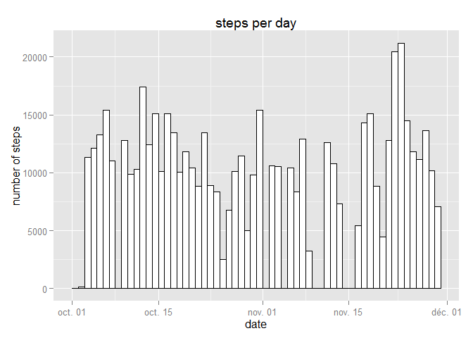
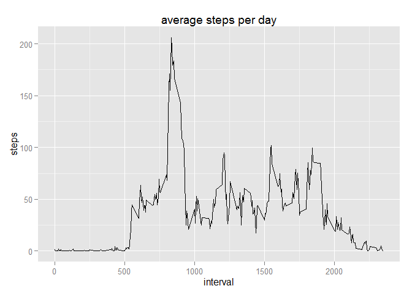
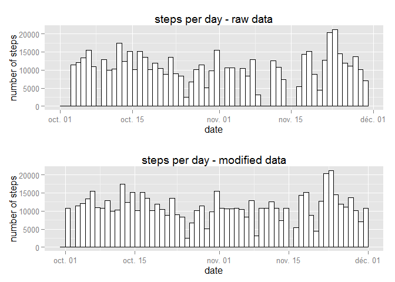
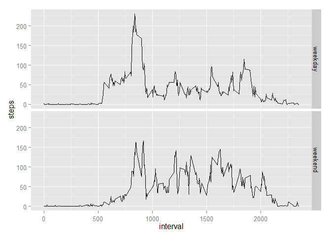

# Reproducible Research: Peer Assessment 1
seb4stien  
Friday, October 17, 2014  


## Loading and preprocessing the data

Loading the [data](https://d396qusza40orc.cloudfront.net/repdata%2Fdata%2Factivity.zip) and converting the date column in Date format.


```r
rawData<-read.csv("data/activity.csv")
goodData<-rawData[!is.na(rawData$steps),]
goodData$date<-as.Date(goodData$date)
```


## What is mean total number of steps taken per day?

A quick look at the steps per day :


```r
library(ggplot2)
qplot(date, weight=steps, data=goodData, ylab="number of steps", main="steps per day", binwidth=1) + geom_bar(fill="white", colour="black", binwidth=1)
```

 

The mean of steps taken per day :

```r
stepsPerDay <- aggregate(steps ~ date, data = goodData, sum)
mean(stepsPerDay$steps)
```

```
## [1] 10766
```

The median of steps taken per day :

```r
median(stepsPerDay$steps)
```

```
## [1] 10765
```


## What is the average daily activity pattern?

Plotting the average steps per day.


```r
avgDailyActivity <- aggregate(steps ~ interval, data=goodData, mean)
qplot(interval, steps, data=avgDailyActivity, geom="line", main="average steps per day")
```

 

Looking for the peak activity : returns the interval corresponding to the maximum value and the maximum value itself : 

```r
maxIndex <- which.max(avgDailyActivity$steps)
avgDailyActivity[maxIndex,]
```

```
##     interval steps
## 104      835 206.2
```


Exploring missing values
------------------------

Number of missing values in the dataset.

```r
sum(is.na(rawData$steps))
```

```
## [1] 2304
```


## Imputing missing values

Filling missing values with the mean of other days on the same interval.

```r
myData <- rawData
for (r in 1:nrow(myData)) {
  if (is.na(myData[r,'steps'])) {
    interval <- myData[r,'interval']
    myData[r,'steps']<-avgDailyActivity[which(avgDailyActivity$interval == interval),'steps']
  }
}
```

And looking at the results :

```r
myStepsPerDay <- aggregate(steps ~ date, data = myData, sum)
myStepsPerDay$date <- as.Date(myStepsPerDay$date)

library(gridExtra)
```

```
## Loading required package: grid
```

```r
p1 <- qplot(date, weight=steps, data=goodData, ylab="number of steps", main="steps per day - raw data", binwidth=1) + geom_bar(fill="white", colour="black", binwidth=1)
p2 <- qplot(date, weight=steps, data=myStepsPerDay, ylab="number of steps", main="steps per day - modified data", binwidth=1) + geom_bar(fill="white", colour="black", binwidth=1)
grid.arrange(p1, p2, nrow=2)
```

 

The mean of steps taken per day :

```r
mean(myStepsPerDay$steps)
```

```
## [1] 10766
```

The median of steps taken per day :

```r
median(myStepsPerDay$steps)
```

```
## [1] 10766
```


## Are there differences in activity patterns between weekdays and weekends?

Introducing a small function to identify weekdays and weekend.

```r
kindOfDay <- function (d) {
  kindOfDay <- "weekday"
  if (weekdays(as.Date(d)) == "Saturday" | weekdays(as.Date(d)) == "samedi") {    kindOfDay <- "weekend "}
  if (weekdays(as.Date(d)) == "Sunday" | weekdays(as.Date(d)) == "dimanche") { kindOfDay <- "weekend "}
  as.factor(kindOfDay)
}

myData$day <- apply(myData, 1, function(row) {kindOfDay(row['date'])})
```

Comparison of the patterns

```r
avgDailyActivity2 <- aggregate(steps ~ interval + day, data=myData, mean)
ggplot(data=avgDailyActivity2, aes(x = interval, y = steps)) + geom_line() + facet_grid(day ~ .)
```

 
